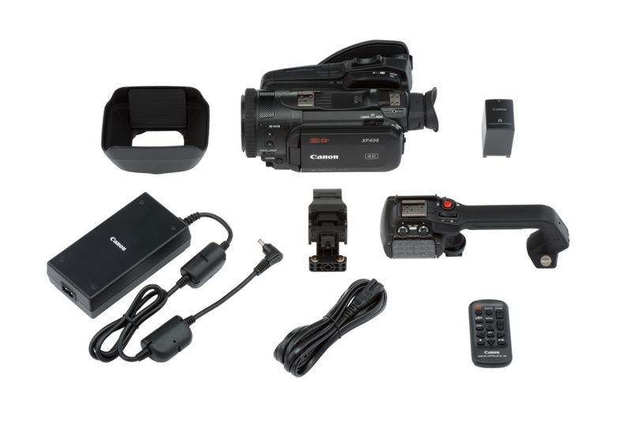
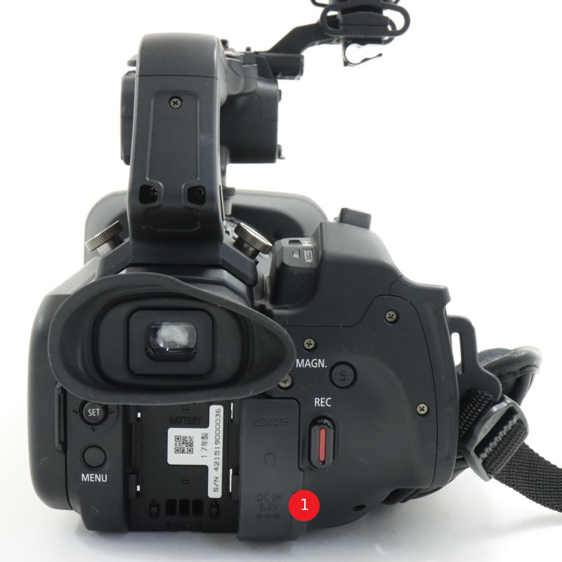
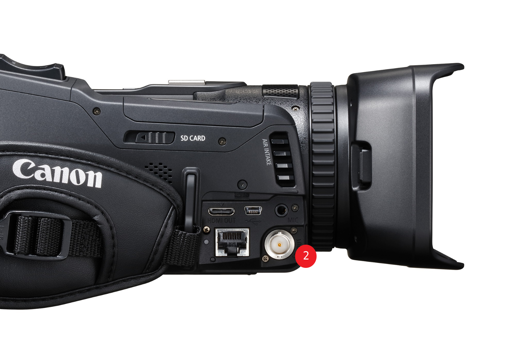

# Kamera

## Kameran käyttöön tarvitaan
* kamerajalka
* (sininen) SDI-kaapeli
* virtajohto

### kameran tarvikkeet

  

### SDI OUT ja HDMI OUT

  

  

## Kameran kytkeminen videomikseriin
1. Kytke virtajohto kameran takaosan luukun alla olevaan `DC IN`-porttiin. ❶
2. Kytke SDI-johto kameran sivulta löytyvän luukun alla `SDI OUT`-porttiin ja kytke johdon toinen pää [videomikseriin](../videomikseri/README.md). ❷
3. Jos kameran kuva ei näy videomikserissä, niin paina kameran takana `MENU`-nappia, valitse filmi-ikoni (toinen välilehti), valitse `Internal/External Rec` -vaihtoehto ja valitse avautuvasta valikosta `External Rec Only (SDI)`. ❸
4. Jos käytät kamerajalkaa, niin varmista, että jalka on kasattu riittävän tukevasti.

## Materiaalit
* [Tuotesivu](https://www.canon.fi/video-cameras/xf-405-and-xf-400/)
* [Pikaopas](quick-guide-fi.pdf)
* [Käyttöopas](manual-fi.pdf)